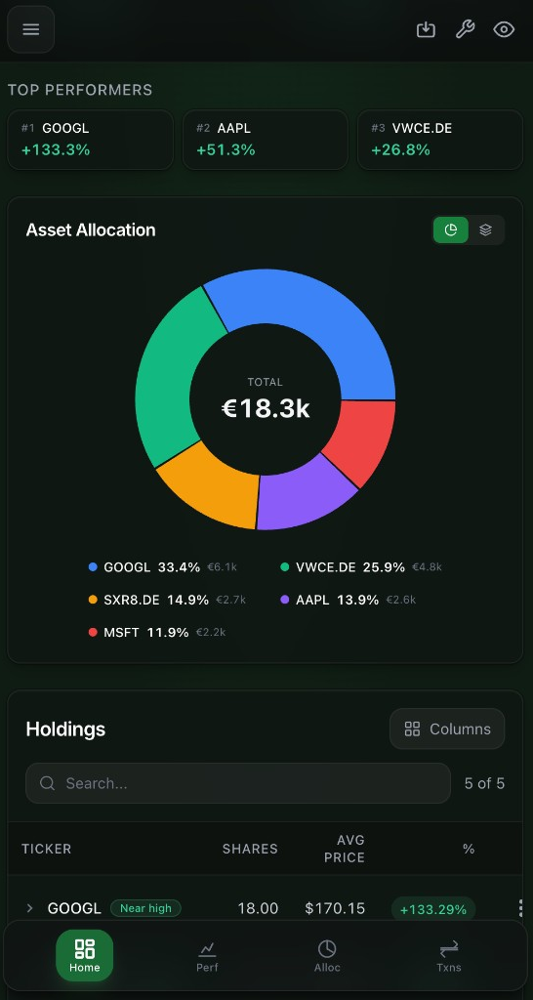
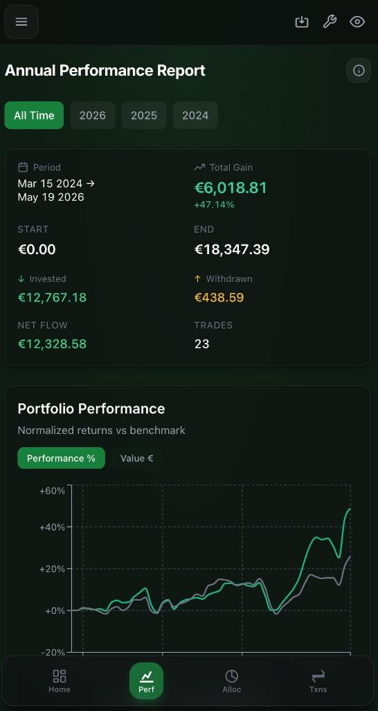
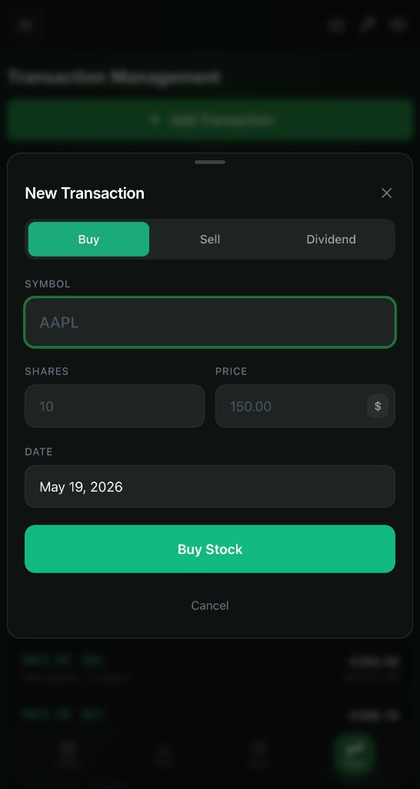

# BeskarFolio

Personal stock portfolio tracker built with FastAPI and React. Your data lives in your browser. The backend fetches prices and runs math. Nothing else.

**[Live demo](https://beskarfolio-web.onrender.com)** -- runs on Render free tier, first request may take 30s to wake.

<p align="center">
  
  
  
</p>

## Why I Built This

I wanted a portfolio tracker that respects privacy and stays simple. No accounts, no cloud sync, no database. Transactions live in browser localStorage, prices come from free APIs with CSV fallback, and the backend is completely stateless.

The project also served as a proving ground for full-stack development outside my day job as a data engineer -- covering FastAPI API design, React/TypeScript frontend, Docker deployment, and multi-provider data ingestion with fallback chains.

## Key Technical Decisions

- **No database** -- localStorage for transactions, CSV files for price history. Simpler to deploy, zero migration headaches, and user data never touches the server.
- **Four-provider price fallback** -- Twelve Data, FMP, Finnhub, yfinance. Each has different rate limits and coverage. The system tries them in order and falls back gracefully.
- **Market-aware price logic** -- Centralized market rules (open/close times, timezones) determine whether to serve a live quote or the last daily close. Prevents stale weekend prices from confusing returns.
- **FIFO tax tracking** -- Implements Slovak 365-day tax-free rule using First-In-First-Out lot accounting. Tracks exactly which shares are tax-exempt and when the next batch qualifies.
- **Time-Weighted Return** -- Industry-standard TWR calculation that eliminates cash flow distortion, so portfolio performance is comparable to benchmarks.

## Features

- Buy/sell transaction tracking with CSV and IBKR import
- Holdings table with live prices and return calculations
- Time-Weighted Return (TWR) for true portfolio performance
- Annual performance reports and realized gains tracking
- Tax-free share tracking (Slovak 365-day FIFO rule)
- Multi-currency support (EUR/USD with daily exchange rates)
- Asset allocation with target rebalancing tool
- AI portfolio analysis (bring your own OpenAI key)
- Auto-refresh prices every 30 minutes in the browser
- PWA with service worker for offline-capable mobile use
- Dark theme UI

## Stack

| Layer | Tech |
|-------|------|
| Backend | FastAPI, Python 3.11, pandas |
| Frontend | React 18, TypeScript, Vite, Tailwind CSS |
| Data | Browser localStorage, CSV files, JSON |
| Infra | Docker, Docker Compose, nginx |
| Prices | Twelve Data, FMP, Finnhub, yfinance |

## Quick Start

Requires Docker.

```bash
git clone https://github.com/martin-gomola/beskarfolio.git
cd beskarfolio
make dev
```

Open `http://localhost:3000`. Add a transaction or import a CSV.

### Production Deployment

```bash
cp config/env.example config/.env   # Add your API keys
make deploy                          # Build and start containers
```

Free tier API keys cover a personal portfolio:

| Provider | Free Tier | Coverage |
|----------|-----------|----------|
| Twelve Data | 800 calls/day | US + EU tickers, historical |
| FMP | 250 calls/day | US tickers, batch quotes |
| Finnhub | 60 calls/min | US tickers, current only |
| yfinance | Unlimited | All tickers (may block Docker IPs) |

### Automated Price Updates

Run once on your server:

```bash
./scripts/setup_server_automation.sh
```

Sets up a daily cron job (8:30 AM) for prices and exchange rates. Manual update anytime via `make update-prices` or the UI button.

## Commands

```bash
make dev            # Development with hot reload
make deploy         # Production build and deploy
make deploy-front   # Frontend only (~10s, needs Node on server)
make deploy-back    # Backend only (~20s)
make logs           # Container logs
make status         # Health check
make update-prices  # Manual price refresh
make rebuild        # Full rebuild from scratch
make help           # All available commands
```

## Architecture

```
backend/
├── api/          # 7 route modules (transactions, portfolio, prices, analytics, ...)
├── logic/        # Business logic (tax, gains, allocation, currency)
│   └── prices/   # Price subsystem (providers, storage, orchestrator, market rules)
├── config/       # Centralized settings
└── data/         # CSV price files + exchange rates (gitignored, created at runtime)

frontend/
├── components/   # UI organized by feature (holdings, portfolio, settings, ...)
├── hooks/        # Custom React hooks (usePortfolio, usePriceStatus, ...)
├── services/     # API client layer
├── types/        # TypeScript definitions
└── utils/        # Formatters, storage, validators
```

## Troubleshooting

| Symptom | Fix |
|---------|-----|
| Slow Docker builds (10+ min) | Ensure `.dockerignore` exists, remove `node_modules` from server |
| API 404 errors | Frontend calls need `/api` prefix |
| Stale UI after deploy | Hard refresh or clear browser cache |
| Prices not updating | Check `make logs` for provider errors |

## License

MIT. For informational purposes only -- not financial advice.
